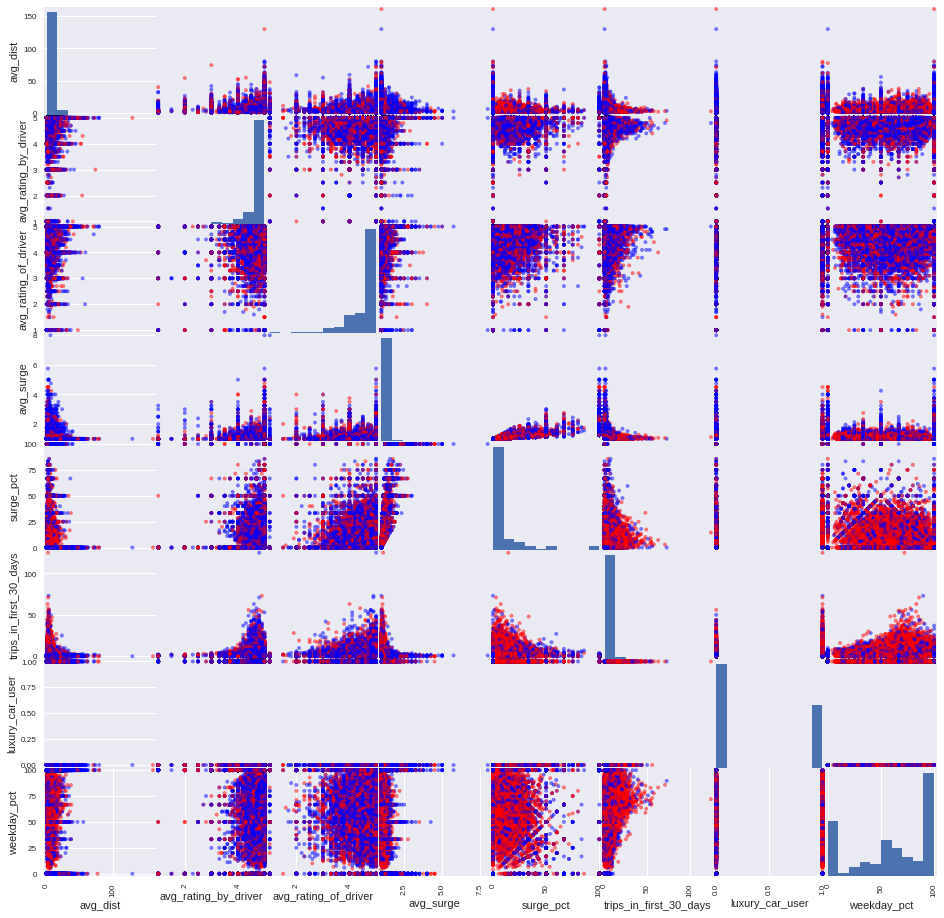
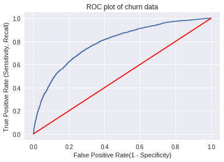
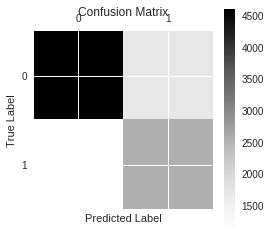

# Churn Prediction 

## Business question

A ride-sharing company is interested in predicting rider retention. An interesting business problem might be who are the users worth retainning? It is cheaper to retain a user than to acquire a user.

## Data
- Data contains users who signed up for an account in January 2014.
- Data was collected in July 1 2014
- Assumption:consider a user retained if they were “active” (i.e. took a trip) in the preceding 30 days (from the day the data was pulled).

### data dictionary
1. city: city this user signed up in
2. phone: primary device for this user
3. signup_date: date of account registration; in the form `YYYYMMDD`
3. last_trip_date: the last time this user completed a trip; in the form `YYYYMMDD`
4. avg_dist: the average distance (in miles) per trip taken in the first 30 days after signup
5. avg_rating_by_driver: the rider’s average rating over all of their trips
6. avg_rating_of_driver: the rider’s average rating of their drivers over all of their trips 
7. surge_pct: the percent of trips taken with surge multiplier > 1
8. avg_surge: The average surge multiplier over all of this user’s trips 
9. trips_in_first_30_days: the number of trips this user took in the first 30 days after signing up
10. luxury_car_user: TRUE if the user took a luxury car in their first 30 days; FALSE otherwise
11. weekday_pct: the percent of the user’s trips occurring during a weekday

## EDA
First step: load, clean, and explore data 


```python
import pandas as pd
import numpy as np
import matplotlib.pyplot as plt
import datetime
# import seaborn
import scipy as sp
%matplotlib inline 
```


```python
data = pd.read_csv('data/churn.csv')
```


```python
# prepare start_date to be 2014-06-01 for active users 
start_date = pd.to_datetime('2014-07-01', format='%Y-%m-%d')
start_date = start_date - datetime.timedelta(30,0,0) 

```


```python
start_date
```


    Timestamp('2014-06-01 00:00:00')


```python
data.head()
```


<div>
<table border="1" class="dataframe">
  <thead>
    <tr style="text-align: right;">
      <th></th>
      <th>avg_dist</th>
      <th>avg_rating_by_driver</th>
      <th>avg_rating_of_driver</th>
      <th>avg_surge</th>
      <th>city</th>
      <th>last_trip_date</th>
      <th>phone</th>
      <th>signup_date</th>
      <th>surge_pct</th>
      <th>trips_in_first_30_days</th>
      <th>luxury_car_user</th>
      <th>weekday_pct</th>
    </tr>
  </thead>
  <tbody>
    <tr>
      <th>0</th>
      <td>3.67</td>
      <td>5.0</td>
      <td>4.7</td>
      <td>1.10</td>
      <td>King's Landing</td>
      <td>2014-06-17</td>
      <td>iPhone</td>
      <td>2014-01-25</td>
      <td>15.4</td>
      <td>4</td>
      <td>True</td>
      <td>46.2</td>
    </tr>
    <tr>
      <th>1</th>
      <td>8.26</td>
      <td>5.0</td>
      <td>5.0</td>
      <td>1.00</td>
      <td>Astapor</td>
      <td>2014-05-05</td>
      <td>Android</td>
      <td>2014-01-29</td>
      <td>0.0</td>
      <td>0</td>
      <td>False</td>
      <td>50.0</td>
    </tr>
    <tr>
      <th>2</th>
      <td>0.77</td>
      <td>5.0</td>
      <td>4.3</td>
      <td>1.00</td>
      <td>Astapor</td>
      <td>2014-01-07</td>
      <td>iPhone</td>
      <td>2014-01-06</td>
      <td>0.0</td>
      <td>3</td>
      <td>False</td>
      <td>100.0</td>
    </tr>
    <tr>
      <th>3</th>
      <td>2.36</td>
      <td>4.9</td>
      <td>4.6</td>
      <td>1.14</td>
      <td>King's Landing</td>
      <td>2014-06-29</td>
      <td>iPhone</td>
      <td>2014-01-10</td>
      <td>20.0</td>
      <td>9</td>
      <td>True</td>
      <td>80.0</td>
    </tr>
    <tr>
      <th>4</th>
      <td>3.13</td>
      <td>4.9</td>
      <td>4.4</td>
      <td>1.19</td>
      <td>Winterfell</td>
      <td>2014-03-15</td>
      <td>Android</td>
      <td>2014-01-27</td>
      <td>11.8</td>
      <td>14</td>
      <td>False</td>
      <td>82.4</td>
    </tr>
  </tbody>
</table>
</div>


```python
data.info()
```

    <class 'pandas.core.frame.DataFrame'>
    RangeIndex: 50000 entries, 0 to 49999
    Data columns (total 12 columns):
    avg_dist                  50000 non-null float64
    avg_rating_by_driver      49799 non-null float64
    avg_rating_of_driver      41878 non-null float64
    avg_surge                 50000 non-null float64
    city                      50000 non-null object
    last_trip_date            50000 non-null object
    phone                     49604 non-null object
    signup_date               50000 non-null object
    surge_pct                 50000 non-null float64
    trips_in_first_30_days    50000 non-null int64
    luxury_car_user           50000 non-null bool
    weekday_pct               50000 non-null float64
    dtypes: bool(1), float64(6), int64(1), object(4)
    memory usage: 4.2+ MB


### Data hygiene

1. fix dates


```python
data.last_trip_date = pd.to_datetime(data.last_trip_date, format='%Y-%m-%d')
data.signup_date = pd.to_datetime(data.signup_date, format='%Y-%m-%d')
```


```python
data.info()
```

    <class 'pandas.core.frame.DataFrame'>
    RangeIndex: 50000 entries, 0 to 49999
    Data columns (total 12 columns):
    avg_dist                  50000 non-null float64
    avg_rating_by_driver      49799 non-null float64
    avg_rating_of_driver      41878 non-null float64
    avg_surge                 50000 non-null float64
    city                      50000 non-null object
    last_trip_date            50000 non-null datetime64[ns]
    phone                     49604 non-null object
    signup_date               50000 non-null datetime64[ns]
    surge_pct                 50000 non-null float64
    trips_in_first_30_days    50000 non-null int64
    luxury_car_user           50000 non-null bool
    weekday_pct               50000 non-null float64
    dtypes: bool(1), datetime64[ns](2), float64(6), int64(1), object(2)
    memory usage: 4.2+ MB


```python
data.city.value_counts()
```


    Winterfell        23336
    Astapor           16534
    King's Landing    10130
    Name: city, dtype: int64


```python
data.phone.value_counts()
```


    iPhone     34582
    Android    15022
    Name: phone, dtype: int64


```python
data.phone = data.phone.fillna('no_phone')
```


```python
data.city = data.city.astype('category')
data.phone = data.phone.astype('category')

```


```python
data.phone.value_counts()
```


    iPhone      34582
    Android     15022
    no_phone      396
    Name: phone, dtype: int64


### create a target

add churn indicator.
consider any last trip date smaller than start_date is a churn 


```python
data['is_active'] = (start_date < data.last_trip_date)
```


```python
data.is_active.value_counts()
```


    False    31690
    True     18310
    Name: is_active, dtype: int64


```python
31690.0 / (31690 + 18310) 
```


    0.6338


looks like over 63% customers have churned...
we might want to ask us a question, should we focus on people who have just churned
or focus on people are are about to churn
or focus on ppl who haven't churned at all


```python
data['churned'] = -data['is_active']
```


```python
data.churned.value_counts()
```


    True     31690
    False    18310
    Name: churned, dtype: int64


check basic stats


```python
data.describe().T
```


<div>
<table border="1" class="dataframe">
  <thead>
    <tr style="text-align: right;">
      <th></th>
      <th>count</th>
      <th>mean</th>
      <th>std</th>
      <th>min</th>
      <th>25%</th>
      <th>50%</th>
      <th>75%</th>
      <th>max</th>
    </tr>
  </thead>
  <tbody>
    <tr>
      <th>avg_dist</th>
      <td>50000.0</td>
      <td>5.796827</td>
      <td>5.707357</td>
      <td>0.0</td>
      <td>2.42</td>
      <td>3.88</td>
      <td>6.94</td>
      <td>160.96</td>
    </tr>
    <tr>
      <th>avg_rating_by_driver</th>
      <td>49799.0</td>
      <td>4.778158</td>
      <td>0.446652</td>
      <td>1.0</td>
      <td>4.70</td>
      <td>5.00</td>
      <td>5.00</td>
      <td>5.00</td>
    </tr>
    <tr>
      <th>avg_rating_of_driver</th>
      <td>41878.0</td>
      <td>4.601559</td>
      <td>0.617338</td>
      <td>1.0</td>
      <td>4.30</td>
      <td>4.90</td>
      <td>5.00</td>
      <td>5.00</td>
    </tr>
    <tr>
      <th>avg_surge</th>
      <td>50000.0</td>
      <td>1.074764</td>
      <td>0.222336</td>
      <td>1.0</td>
      <td>1.00</td>
      <td>1.00</td>
      <td>1.05</td>
      <td>8.00</td>
    </tr>
    <tr>
      <th>surge_pct</th>
      <td>50000.0</td>
      <td>8.849536</td>
      <td>19.958811</td>
      <td>0.0</td>
      <td>0.00</td>
      <td>0.00</td>
      <td>8.60</td>
      <td>100.00</td>
    </tr>
    <tr>
      <th>trips_in_first_30_days</th>
      <td>50000.0</td>
      <td>2.278200</td>
      <td>3.792684</td>
      <td>0.0</td>
      <td>0.00</td>
      <td>1.00</td>
      <td>3.00</td>
      <td>125.00</td>
    </tr>
    <tr>
      <th>weekday_pct</th>
      <td>50000.0</td>
      <td>60.926084</td>
      <td>37.081503</td>
      <td>0.0</td>
      <td>33.30</td>
      <td>66.70</td>
      <td>100.00</td>
      <td>100.00</td>
    </tr>
  </tbody>
</table>
</div>


check how correlated each two variable pair through pearson method


```python
data.corr(method='pearson')
```


<div>
<table border="1" class="dataframe">
  <thead>
    <tr style="text-align: right;">
      <th></th>
      <th>avg_dist</th>
      <th>avg_rating_by_driver</th>
      <th>avg_rating_of_driver</th>
      <th>avg_surge</th>
      <th>surge_pct</th>
      <th>trips_in_first_30_days</th>
      <th>luxury_car_user</th>
      <th>weekday_pct</th>
      <th>is_active</th>
      <th>churned</th>
    </tr>
  </thead>
  <tbody>
    <tr>
      <th>avg_dist</th>
      <td>1.000000</td>
      <td>0.080540</td>
      <td>0.034509</td>
      <td>-0.081491</td>
      <td>-0.104414</td>
      <td>-0.136329</td>
      <td>0.032310</td>
      <td>0.101652</td>
      <td>-0.090279</td>
      <td>0.090279</td>
    </tr>
    <tr>
      <th>avg_rating_by_driver</th>
      <td>0.080540</td>
      <td>1.000000</td>
      <td>0.123175</td>
      <td>0.010597</td>
      <td>0.020103</td>
      <td>-0.039115</td>
      <td>0.009343</td>
      <td>0.020442</td>
      <td>-0.025635</td>
      <td>0.025635</td>
    </tr>
    <tr>
      <th>avg_rating_of_driver</th>
      <td>0.034509</td>
      <td>0.123175</td>
      <td>1.000000</td>
      <td>-0.026189</td>
      <td>-0.003899</td>
      <td>-0.011302</td>
      <td>-0.002086</td>
      <td>0.014630</td>
      <td>-0.010834</td>
      <td>0.010834</td>
    </tr>
    <tr>
      <th>avg_surge</th>
      <td>-0.081491</td>
      <td>0.010597</td>
      <td>-0.026189</td>
      <td>1.000000</td>
      <td>0.793582</td>
      <td>-0.001841</td>
      <td>-0.078791</td>
      <td>-0.110071</td>
      <td>-0.003567</td>
      <td>0.003567</td>
    </tr>
    <tr>
      <th>surge_pct</th>
      <td>-0.104414</td>
      <td>0.020103</td>
      <td>-0.003899</td>
      <td>0.793582</td>
      <td>1.000000</td>
      <td>0.005720</td>
      <td>-0.106861</td>
      <td>-0.144918</td>
      <td>0.010612</td>
      <td>-0.010612</td>
    </tr>
    <tr>
      <th>trips_in_first_30_days</th>
      <td>-0.136329</td>
      <td>-0.039115</td>
      <td>-0.011302</td>
      <td>-0.001841</td>
      <td>0.005720</td>
      <td>1.000000</td>
      <td>0.112210</td>
      <td>0.050388</td>
      <td>0.214728</td>
      <td>-0.214728</td>
    </tr>
    <tr>
      <th>luxury_car_user</th>
      <td>0.032310</td>
      <td>0.009343</td>
      <td>-0.002086</td>
      <td>-0.078791</td>
      <td>-0.106861</td>
      <td>0.112210</td>
      <td>1.000000</td>
      <td>0.035998</td>
      <td>0.210259</td>
      <td>-0.210259</td>
    </tr>
    <tr>
      <th>weekday_pct</th>
      <td>0.101652</td>
      <td>0.020442</td>
      <td>0.014630</td>
      <td>-0.110071</td>
      <td>-0.144918</td>
      <td>0.050388</td>
      <td>0.035998</td>
      <td>1.000000</td>
      <td>0.026413</td>
      <td>-0.026413</td>
    </tr>
    <tr>
      <th>is_active</th>
      <td>-0.090279</td>
      <td>-0.025635</td>
      <td>-0.010834</td>
      <td>-0.003567</td>
      <td>0.010612</td>
      <td>0.214728</td>
      <td>0.210259</td>
      <td>0.026413</td>
      <td>1.000000</td>
      <td>-1.000000</td>
    </tr>
    <tr>
      <th>churned</th>
      <td>0.090279</td>
      <td>0.025635</td>
      <td>0.010834</td>
      <td>0.003567</td>
      <td>-0.010612</td>
      <td>-0.214728</td>
      <td>-0.210259</td>
      <td>-0.026413</td>
      <td>-1.000000</td>
      <td>1.000000</td>
    </tr>
  </tbody>
</table>
</div>


there are ofen errors with dates, so I will perform some simple checks


```python
np.any(data.last_trip_date < data.signup_date)
```


    False


```python
data['signup_year'] = data.signup_date.apply(lambda x: x.year)
data['signup_month']= data.signup_date.apply(lambda x: x.month)
pd.crosstab(data.signup_month, data.signup_year)
```


<div>
<table border="1" class="dataframe">
  <thead>
    <tr style="text-align: right;">
      <th>signup_year</th>
      <th>2014</th>
    </tr>
    <tr>
      <th>signup_month</th>
      <th></th>
    </tr>
  </thead>
  <tbody>
    <tr>
      <th>1</th>
      <td>50000</td>
    </tr>
  </tbody>
</table>
</div>


all the users signed up in Jan, we don't need to worry about they signed up in the last 30 days


```python
data.signup_date.describe()
```


    count                   50000
    unique                     31
    top       2014-01-18 00:00:00
    freq                     2948
    first     2014-01-01 00:00:00
    last      2014-01-31 00:00:00
    Name: signup_date, dtype: object


```python
data['last_year'] = data.last_trip_date.apply(lambda x: x.year)
data['last_month'] = data.last_trip_date.apply(lambda x: x.month)
pd.crosstab(data.last_month, data.last_year)
```


<div>
<table border="1" class="dataframe">
  <thead>
    <tr style="text-align: right;">
      <th>last_year</th>
      <th>2014</th>
    </tr>
    <tr>
      <th>last_month</th>
      <th></th>
    </tr>
  </thead>
  <tbody>
    <tr>
      <th>1</th>
      <td>10147</td>
    </tr>
    <tr>
      <th>2</th>
      <td>4308</td>
    </tr>
    <tr>
      <th>3</th>
      <td>4568</td>
    </tr>
    <tr>
      <th>4</th>
      <td>4588</td>
    </tr>
    <tr>
      <th>5</th>
      <td>7585</td>
    </tr>
    <tr>
      <th>6</th>
      <td>18256</td>
    </tr>
    <tr>
      <th>7</th>
      <td>548</td>
    </tr>
  </tbody>
</table>
</div>


let's check some simple 'groupby' stats to see how different groups compare


```python
data.groupby(['is_active', 'last_month']).mean()
```


<div>
<table border="1" class="dataframe">
  <thead>
    <tr style="text-align: right;">
      <th></th>
      <th></th>
      <th>avg_dist</th>
      <th>avg_rating_by_driver</th>
      <th>avg_rating_of_driver</th>
      <th>avg_surge</th>
      <th>surge_pct</th>
      <th>trips_in_first_30_days</th>
      <th>luxury_car_user</th>
      <th>weekday_pct</th>
      <th>churned</th>
      <th>signup_year</th>
      <th>signup_month</th>
      <th>last_year</th>
    </tr>
    <tr>
      <th>is_active</th>
      <th>last_month</th>
      <th></th>
      <th></th>
      <th></th>
      <th></th>
      <th></th>
      <th></th>
      <th></th>
      <th></th>
      <th></th>
      <th></th>
      <th></th>
      <th></th>
    </tr>
  </thead>
  <tbody>
    <tr>
      <th rowspan="6" valign="top">False</th>
      <th>1</th>
      <td>6.816549</td>
      <td>4.806602</td>
      <td>4.633324</td>
      <td>1.078925</td>
      <td>8.926274</td>
      <td>1.710161</td>
      <td>0.287868</td>
      <td>59.999704</td>
      <td>1.0</td>
      <td>2014.0</td>
      <td>1.0</td>
      <td>2014.0</td>
    </tr>
    <tr>
      <th>2</th>
      <td>6.038006</td>
      <td>4.778979</td>
      <td>4.585495</td>
      <td>1.089396</td>
      <td>9.338649</td>
      <td>2.112813</td>
      <td>0.305942</td>
      <td>61.031848</td>
      <td>1.0</td>
      <td>2014.0</td>
      <td>1.0</td>
      <td>2014.0</td>
    </tr>
    <tr>
      <th>3</th>
      <td>5.882500</td>
      <td>4.778203</td>
      <td>4.591581</td>
      <td>1.085274</td>
      <td>8.715740</td>
      <td>1.290061</td>
      <td>0.318739</td>
      <td>57.635924</td>
      <td>1.0</td>
      <td>2014.0</td>
      <td>1.0</td>
      <td>2014.0</td>
    </tr>
    <tr>
      <th>4</th>
      <td>6.038993</td>
      <td>4.773951</td>
      <td>4.599419</td>
      <td>1.060728</td>
      <td>7.656168</td>
      <td>1.378814</td>
      <td>0.318221</td>
      <td>62.013622</td>
      <td>1.0</td>
      <td>2014.0</td>
      <td>1.0</td>
      <td>2014.0</td>
    </tr>
    <tr>
      <th>5</th>
      <td>5.788456</td>
      <td>4.780513</td>
      <td>4.602883</td>
      <td>1.065413</td>
      <td>8.519684</td>
      <td>1.722347</td>
      <td>0.290310</td>
      <td>62.281239</td>
      <td>1.0</td>
      <td>2014.0</td>
      <td>1.0</td>
      <td>2014.0</td>
    </tr>
    <tr>
      <th>6</th>
      <td>4.959534</td>
      <td>4.749797</td>
      <td>4.576047</td>
      <td>1.077105</td>
      <td>10.065789</td>
      <td>1.702429</td>
      <td>0.279352</td>
      <td>30.789474</td>
      <td>1.0</td>
      <td>2014.0</td>
      <td>1.0</td>
      <td>2014.0</td>
    </tr>
    <tr>
      <th rowspan="2" valign="top">True</th>
      <th>6</th>
      <td>5.147640</td>
      <td>4.763216</td>
      <td>4.592054</td>
      <td>1.073605</td>
      <td>9.094961</td>
      <td>3.291071</td>
      <td>0.511316</td>
      <td>61.948897</td>
      <td>0.0</td>
      <td>2014.0</td>
      <td>1.0</td>
      <td>2014.0</td>
    </tr>
    <tr>
      <th>7</th>
      <td>4.189927</td>
      <td>4.760036</td>
      <td>4.633271</td>
      <td>1.077464</td>
      <td>10.204380</td>
      <td>5.246350</td>
      <td>0.505474</td>
      <td>70.826825</td>
      <td>0.0</td>
      <td>2014.0</td>
      <td>1.0</td>
      <td>2014.0</td>
    </tr>
  </tbody>
</table>
</div>


it seems active users appear to take shorter trips on average, had more trips in the first 30 days, and use luxury cars more often.


```python
data.groupby(['is_active', 'last_month']).quantile(q=0.75)
```


<div>
<table border="1" class="dataframe">
  <thead>
    <tr style="text-align: right;">
      <th></th>
      <th>0.75</th>
      <th>avg_dist</th>
      <th>avg_rating_by_driver</th>
      <th>avg_rating_of_driver</th>
      <th>avg_surge</th>
      <th>churned</th>
      <th>last_year</th>
      <th>luxury_car_user</th>
      <th>signup_month</th>
      <th>signup_year</th>
      <th>surge_pct</th>
      <th>trips_in_first_30_days</th>
      <th>weekday_pct</th>
    </tr>
    <tr>
      <th>is_active</th>
      <th>last_month</th>
      <th></th>
      <th></th>
      <th></th>
      <th></th>
      <th></th>
      <th></th>
      <th></th>
      <th></th>
      <th></th>
      <th></th>
      <th></th>
      <th></th>
    </tr>
  </thead>
  <tbody>
    <tr>
      <th rowspan="6" valign="top">False</th>
      <th>1</th>
      <td>9.1900</td>
      <td>5.0</td>
      <td>5.0</td>
      <td>1.00</td>
      <td>1.0</td>
      <td>2014.0</td>
      <td>1.0</td>
      <td>1.0</td>
      <td>2014.0</td>
      <td>0.000</td>
      <td>2.0</td>
      <td>100.000</td>
    </tr>
    <tr>
      <th>2</th>
      <td>7.7400</td>
      <td>5.0</td>
      <td>5.0</td>
      <td>1.00</td>
      <td>1.0</td>
      <td>2014.0</td>
      <td>1.0</td>
      <td>1.0</td>
      <td>2014.0</td>
      <td>0.000</td>
      <td>3.0</td>
      <td>100.000</td>
    </tr>
    <tr>
      <th>3</th>
      <td>7.1525</td>
      <td>5.0</td>
      <td>5.0</td>
      <td>1.00</td>
      <td>1.0</td>
      <td>2014.0</td>
      <td>1.0</td>
      <td>1.0</td>
      <td>2014.0</td>
      <td>0.000</td>
      <td>1.0</td>
      <td>100.000</td>
    </tr>
    <tr>
      <th>4</th>
      <td>7.5400</td>
      <td>5.0</td>
      <td>5.0</td>
      <td>1.00</td>
      <td>1.0</td>
      <td>2014.0</td>
      <td>1.0</td>
      <td>1.0</td>
      <td>2014.0</td>
      <td>0.000</td>
      <td>2.0</td>
      <td>100.000</td>
    </tr>
    <tr>
      <th>5</th>
      <td>6.8700</td>
      <td>5.0</td>
      <td>5.0</td>
      <td>1.05</td>
      <td>1.0</td>
      <td>2014.0</td>
      <td>1.0</td>
      <td>1.0</td>
      <td>2014.0</td>
      <td>10.000</td>
      <td>2.0</td>
      <td>100.000</td>
    </tr>
    <tr>
      <th>6</th>
      <td>6.1875</td>
      <td>5.0</td>
      <td>5.0</td>
      <td>1.09</td>
      <td>1.0</td>
      <td>2014.0</td>
      <td>1.0</td>
      <td>1.0</td>
      <td>2014.0</td>
      <td>14.300</td>
      <td>2.0</td>
      <td>53.800</td>
    </tr>
    <tr>
      <th rowspan="2" valign="top">True</th>
      <th>6</th>
      <td>5.9100</td>
      <td>5.0</td>
      <td>5.0</td>
      <td>1.09</td>
      <td>0.0</td>
      <td>2014.0</td>
      <td>1.0</td>
      <td>1.0</td>
      <td>2014.0</td>
      <td>13.300</td>
      <td>4.0</td>
      <td>85.700</td>
    </tr>
    <tr>
      <th>7</th>
      <td>4.9100</td>
      <td>4.9</td>
      <td>5.0</td>
      <td>1.11</td>
      <td>0.0</td>
      <td>2014.0</td>
      <td>1.0</td>
      <td>1.0</td>
      <td>2014.0</td>
      <td>14.825</td>
      <td>7.0</td>
      <td>84.125</td>
    </tr>
  </tbody>
</table>
</div>


```python
data.groupby(['is_active', 'last_month']).std()
```


<div>
<table border="1" class="dataframe">
  <thead>
    <tr style="text-align: right;">
      <th></th>
      <th></th>
      <th>avg_dist</th>
      <th>avg_rating_by_driver</th>
      <th>avg_rating_of_driver</th>
      <th>avg_surge</th>
      <th>surge_pct</th>
      <th>trips_in_first_30_days</th>
      <th>luxury_car_user</th>
      <th>weekday_pct</th>
      <th>churned</th>
      <th>signup_year</th>
      <th>signup_month</th>
      <th>last_year</th>
    </tr>
    <tr>
      <th>is_active</th>
      <th>last_month</th>
      <th></th>
      <th></th>
      <th></th>
      <th></th>
      <th></th>
      <th></th>
      <th></th>
      <th></th>
      <th></th>
      <th></th>
      <th></th>
      <th></th>
    </tr>
  </thead>
  <tbody>
    <tr>
      <th rowspan="6" valign="top">False</th>
      <th>1</th>
      <td>7.013694</td>
      <td>0.574543</td>
      <td>0.689215</td>
      <td>0.304895</td>
      <td>25.980567</td>
      <td>1.551805</td>
      <td>0.452792</td>
      <td>46.420268</td>
      <td>0.0</td>
      <td>0.0</td>
      <td>0.0</td>
      <td>0.0</td>
    </tr>
    <tr>
      <th>2</th>
      <td>6.068764</td>
      <td>0.548422</td>
      <td>0.706111</td>
      <td>0.283917</td>
      <td>23.251825</td>
      <td>2.580902</td>
      <td>0.460859</td>
      <td>41.123237</td>
      <td>0.0</td>
      <td>0.0</td>
      <td>0.0</td>
      <td>0.0</td>
    </tr>
    <tr>
      <th>3</th>
      <td>6.073346</td>
      <td>0.483683</td>
      <td>0.682383</td>
      <td>0.267277</td>
      <td>21.283339</td>
      <td>3.042242</td>
      <td>0.466039</td>
      <td>40.520700</td>
      <td>0.0</td>
      <td>0.0</td>
      <td>0.0</td>
      <td>0.0</td>
    </tr>
    <tr>
      <th>4</th>
      <td>5.684452</td>
      <td>0.465194</td>
      <td>0.629729</td>
      <td>0.179838</td>
      <td>18.370067</td>
      <td>2.936937</td>
      <td>0.465837</td>
      <td>37.450785</td>
      <td>0.0</td>
      <td>0.0</td>
      <td>0.0</td>
      <td>0.0</td>
    </tr>
    <tr>
      <th>5</th>
      <td>5.553574</td>
      <td>0.404029</td>
      <td>0.619594</td>
      <td>0.163539</td>
      <td>18.315359</td>
      <td>3.305858</td>
      <td>0.453935</td>
      <td>34.905845</td>
      <td>0.0</td>
      <td>0.0</td>
      <td>0.0</td>
      <td>0.0</td>
    </tr>
    <tr>
      <th>6</th>
      <td>4.115148</td>
      <td>0.450910</td>
      <td>0.687388</td>
      <td>0.162823</td>
      <td>18.902930</td>
      <td>3.111601</td>
      <td>0.449136</td>
      <td>28.626718</td>
      <td>0.0</td>
      <td>0.0</td>
      <td>0.0</td>
      <td>0.0</td>
    </tr>
    <tr>
      <th rowspan="2" valign="top">True</th>
      <th>6</th>
      <td>4.668550</td>
      <td>0.326044</td>
      <td>0.539787</td>
      <td>0.164427</td>
      <td>15.553910</td>
      <td>4.934725</td>
      <td>0.499886</td>
      <td>29.294894</td>
      <td>0.0</td>
      <td>0.0</td>
      <td>0.0</td>
      <td>0.0</td>
    </tr>
    <tr>
      <th>7</th>
      <td>2.882536</td>
      <td>0.272690</td>
      <td>0.484955</td>
      <td>0.115908</td>
      <td>13.194029</td>
      <td>7.021480</td>
      <td>0.500427</td>
      <td>18.453815</td>
      <td>0.0</td>
      <td>0.0</td>
      <td>0.0</td>
      <td>0.0</td>
    </tr>
  </tbody>
</table>
</div>


### Visualization

we plot active users as red, and inactive users as blue


```python
from pandas.tools.plotting import scatter_matrix
```


```python
data.columns
```


    Index([u'avg_dist', u'avg_rating_by_driver', u'avg_rating_of_driver',
           u'avg_surge', u'city', u'last_trip_date', u'phone', u'signup_date',
           u'surge_pct', u'trips_in_first_30_days', u'luxury_car_user',
           u'weekday_pct', u'is_active', u'churned', u'signup_year',
           u'signup_month', u'last_year', u'last_month'],
          dtype='object')


```python
core_features = ['avg_dist', 'avg_rating_by_driver', 'avg_rating_of_driver',
       'avg_surge', 'surge_pct', 'trips_in_first_30_days', 'luxury_car_user',
       'weekday_pct', 'city']
```


```python
colors = ['red' if ix else 'blue' for ix in data.is_active ]
```


```python
scatter_matrix(data[core_features], alpha=0.5, figsize=(16,16), diagonal='hist', c=colors);
```





The scatter matrix does not show any feature which clearly separate out active users from inactive users.
Thus, we probably have a high non-linear relationship and should consider
a random forest or a gradient boosted decision tree. With a lot of feature engineering,
we might be able to get comparable performance from logistic regression.
SVM alomst will not work because there is no clear separation of positive and 
negative classes. 

### Missing Data


```python
data.apply(lambda x: np.sum(pd.isnull(x)))
```


    avg_dist                     0
    avg_rating_by_driver       201
    avg_rating_of_driver      8122
    avg_surge                    0
    city                         0
    last_trip_date               0
    phone                        0
    signup_date                  0
    surge_pct                    0
    trips_in_first_30_days       0
    luxury_car_user              0
    weekday_pct                  0
    is_active                    0
    churned                      0
    signup_year                  0
    signup_month                 0
    last_year                    0
    last_month                   0
    dtype: int64


```python
8122 / 50000.0
```


    0.16244


```python
201 / 50000.0
```


    0.00402


so, ~16% of avg_rating_of_drvier is missing, which means we probably should not drop this data.
I can do a simple t-test to see if distribution of features is different for rows with/without missing
values. 


```python
#helper function
def ttest_by(vals, by):
    '''Compute a t-test on a column based on an indicator for which sample the values are in.'''
    vals1 = vals[by]
    vals2 = vals[-by]
    
    return sp.stats.ttest_ind(vals1, vals2)
```


```python
ttest_by(data.avg_dist, pd.isnull(data.avg_rating_by_driver))
```


    Ttest_indResult(statistic=0.92179603168389357, pvalue=0.35663942563201456)


We can not reject Ho due to the p-value. This means the data is missing at random.
We can impute the missing values or bin the feature by + a bin for missing, or build a model using other features to predict this feature values 
For now, I will replace the missing values by mode


```python
ttest_by(data.avg_dist, pd.isnull(data.avg_rating_of_driver))
```


    Ttest_indResult(statistic=29.754284259108406, pvalue=7.407707064855626e-193)


we can reject Ho. Siss missing values are so rare of avg_rating_of_driver: 
    0.0004, we can just dump these data. 


```python
df = data[(pd.notnull(data.avg_rating_by_driver))]
```


```python
df.info()
```

    <class 'pandas.core.frame.DataFrame'>
    Int64Index: 49799 entries, 0 to 49999
    Data columns (total 18 columns):
    avg_dist                  49799 non-null float64
    avg_rating_by_driver      49799 non-null float64
    avg_rating_of_driver      41744 non-null float64
    avg_surge                 49799 non-null float64
    city                      49799 non-null category
    last_trip_date            49799 non-null datetime64[ns]
    phone                     49799 non-null category
    signup_date               49799 non-null datetime64[ns]
    surge_pct                 49799 non-null float64
    trips_in_first_30_days    49799 non-null int64
    luxury_car_user           49799 non-null bool
    weekday_pct               49799 non-null float64
    is_active                 49799 non-null bool
    churned                   49799 non-null bool
    signup_year               49799 non-null int64
    signup_month              49799 non-null int64
    last_year                 49799 non-null int64
    last_month                49799 non-null int64
    dtypes: bool(3), category(2), datetime64[ns](2), float64(6), int64(5)
    memory usage: 5.6 MB


Check that dropping rows with missing avg_rating_by_driver does not remove key observation.


```python
pd.crosstab(data.churned, data.is_active)
```


<div>
<table border="1" class="dataframe">
  <thead>
    <tr style="text-align: right;">
      <th>is_active</th>
      <th>False</th>
      <th>True</th>
    </tr>
    <tr>
      <th>churned</th>
      <th></th>
      <th></th>
    </tr>
  </thead>
  <tbody>
    <tr>
      <th>False</th>
      <td>0</td>
      <td>18310</td>
    </tr>
    <tr>
      <th>True</th>
      <td>31690</td>
      <td>0</td>
    </tr>
  </tbody>
</table>
</div>


```python
pd.crosstab(df.churned, df.is_active)
```


<div>
<table border="1" class="dataframe">
  <thead>
    <tr style="text-align: right;">
      <th>is_active</th>
      <th>False</th>
      <th>True</th>
    </tr>
    <tr>
      <th>churned</th>
      <th></th>
      <th></th>
    </tr>
  </thead>
  <tbody>
    <tr>
      <th>False</th>
      <td>0</td>
      <td>18276</td>
    </tr>
    <tr>
      <th>True</th>
      <td>31523</td>
      <td>0</td>
    </tr>
  </tbody>
</table>
</div>


## Missing Data: solution 
1. drop the avg_rating_by_driver with missing data: 201 data points
2. quantize avg_rating_of_driver with missing data. add missing bin value for quantized
features, typically use deciles. 

Because a significant fraction of people only give out a rating of
5 and there are disincentives to give a ratio below 4(users need to file out the reasons on the phone == inconvinience), we choose appropriate cuts below. If data was distributed evenly, we would cut by quantile.


```python
df['bin_avg_rating_of_driver']= pd.cut(df.avg_rating_of_driver, bins=[0., 2.99, 3.99, 4.99, 5], 
                                       include_lowest=True, right=True)
```

    /home/joanna/anaconda2/lib/python2.7/site-packages/ipykernel/__main__.py:2: SettingWithCopyWarning: 
    A value is trying to be set on a copy of a slice from a DataFrame.
    Try using .loc[row_indexer,col_indexer] = value instead
    
    See the caveats in the documentation: http://pandas.pydata.org/pandas-docs/stable/indexing.html#indexing-view-versus-copy
      from ipykernel import kernelapp as app


```python
pd.crosstab(df.bin_avg_rating_of_driver, df.is_active)
```


<div>
<table border="1" class="dataframe">
  <thead>
    <tr style="text-align: right;">
      <th>is_active</th>
      <th>False</th>
      <th>True</th>
    </tr>
    <tr>
      <th>bin_avg_rating_of_driver</th>
      <th></th>
      <th></th>
    </tr>
  </thead>
  <tbody>
    <tr>
      <th>[0, 2.99]</th>
      <td>515</td>
      <td>178</td>
    </tr>
    <tr>
      <th>(2.99, 3.99]</th>
      <td>1727</td>
      <td>1376</td>
    </tr>
    <tr>
      <th>(3.99, 4.99]</th>
      <td>8304</td>
      <td>8970</td>
    </tr>
    <tr>
      <th>(4.99, 5]</th>
      <td>14470</td>
      <td>6204</td>
    </tr>
  </tbody>
</table>
</div>


```python
# add the missing value category
df.bin_avg_rating_of_driver.cat.add_categories('missing', inplace=True)
```


```python
# fill in na 
df.bin_avg_rating_of_driver.fillna('missing', inplace=True)
```


```python
pd.crosstab(df.bin_avg_rating_of_driver, df.is_active, margins=True)
```


<div>
<table border="1" class="dataframe">
  <thead>
    <tr style="text-align: right;">
      <th>is_active</th>
      <th>False</th>
      <th>True</th>
      <th>All</th>
    </tr>
    <tr>
      <th>bin_avg_rating_of_driver</th>
      <th></th>
      <th></th>
      <th></th>
    </tr>
  </thead>
  <tbody>
    <tr>
      <th>[0, 2.99]</th>
      <td>515</td>
      <td>178</td>
      <td>693</td>
    </tr>
    <tr>
      <th>(2.99, 3.99]</th>
      <td>1727</td>
      <td>1376</td>
      <td>3103</td>
    </tr>
    <tr>
      <th>(3.99, 4.99]</th>
      <td>8304</td>
      <td>8970</td>
      <td>17274</td>
    </tr>
    <tr>
      <th>(4.99, 5]</th>
      <td>14470</td>
      <td>6204</td>
      <td>20674</td>
    </tr>
    <tr>
      <th>missing</th>
      <td>6507</td>
      <td>1548</td>
      <td>8055</td>
    </tr>
    <tr>
      <th>All</th>
      <td>31523</td>
      <td>18276</td>
      <td>49799</td>
    </tr>
  </tbody>
</table>
</div>


Now let's convert them to dummy variables. 


```python
#give dummy columns names
df_dum_of.columns = map(lambda x: 'bin_of_driver_' + str(x), df_dum_of.columns)
# dummify the values
df_dum_of = pd.get_dummies(df.bin_avg_rating_of_driver)
df_dum_of.apply(lambda x: x.value_counts())
```


<div>
<table border="1" class="dataframe">
  <thead>
    <tr style="text-align: right;">
      <th></th>
      <th>[0, 2.99]</th>
      <th>(2.99, 3.99]</th>
      <th>(3.99, 4.99]</th>
      <th>(4.99, 5]</th>
      <th>missing</th>
    </tr>
  </thead>
  <tbody>
    <tr>
      <th>0</th>
      <td>49106</td>
      <td>46696</td>
      <td>32525</td>
      <td>29125</td>
      <td>41744</td>
    </tr>
    <tr>
      <th>1</th>
      <td>693</td>
      <td>3103</td>
      <td>17274</td>
      <td>20674</td>
      <td>8055</td>
    </tr>
  </tbody>
</table>
</div>


```python
df_dum_of
```


<div>
<table border="1" class="dataframe">
  <thead>
    <tr style="text-align: right;">
      <th></th>
      <th>[0, 2.99]</th>
      <th>(2.99, 3.99]</th>
      <th>(3.99, 4.99]</th>
      <th>(4.99, 5]</th>
      <th>missing</th>
    </tr>
  </thead>
  <tbody>
    <tr>
      <th>0</th>
      <td>0</td>
      <td>0</td>
      <td>1</td>
      <td>0</td>
      <td>0</td>
    </tr>
    <tr>
      <th>1</th>
      <td>0</td>
      <td>0</td>
      <td>0</td>
      <td>1</td>
      <td>0</td>
    </tr>
    <tr>
      <th>2</th>
      <td>0</td>
      <td>0</td>
      <td>1</td>
      <td>0</td>
      <td>0</td>
    </tr>
    <tr>
      <th>3</th>
      <td>0</td>
      <td>0</td>
      <td>1</td>
      <td>0</td>
      <td>0</td>
    </tr>
    <tr>
      <th>4</th>
      <td>0</td>
      <td>0</td>
      <td>1</td>
      <td>0</td>
      <td>0</td>
    </tr>
    <tr>
      <th>5</th>
      <td>0</td>
      <td>1</td>
      <td>0</td>
      <td>0</td>
      <td>0</td>
    </tr>
    <tr>
      <th>6</th>
      <td>0</td>
      <td>0</td>
      <td>0</td>
      <td>0</td>
      <td>1</td>
    </tr>
    <tr>
      <th>7</th>
      <td>0</td>
      <td>0</td>
      <td>0</td>
      <td>1</td>
      <td>0</td>
    </tr>
    <tr>
      <th>8</th>
      <td>0</td>
      <td>0</td>
      <td>1</td>
      <td>0</td>
      <td>0</td>
    </tr>
    <tr>
      <th>9</th>
      <td>0</td>
      <td>0</td>
      <td>0</td>
      <td>0</td>
      <td>1</td>
    </tr>
    <tr>
      <th>10</th>
      <td>0</td>
      <td>0</td>
      <td>0</td>
      <td>1</td>
      <td>0</td>
    </tr>
    <tr>
      <th>11</th>
      <td>0</td>
      <td>0</td>
      <td>1</td>
      <td>0</td>
      <td>0</td>
    </tr>
    <tr>
      <th>12</th>
      <td>0</td>
      <td>0</td>
      <td>0</td>
      <td>0</td>
      <td>1</td>
    </tr>
    <tr>
      <th>13</th>
      <td>0</td>
      <td>0</td>
      <td>1</td>
      <td>0</td>
      <td>0</td>
    </tr>
    <tr>
      <th>14</th>
      <td>0</td>
      <td>0</td>
      <td>0</td>
      <td>0</td>
      <td>1</td>
    </tr>
    <tr>
      <th>15</th>
      <td>0</td>
      <td>0</td>
      <td>0</td>
      <td>0</td>
      <td>1</td>
    </tr>
    <tr>
      <th>16</th>
      <td>0</td>
      <td>0</td>
      <td>0</td>
      <td>1</td>
      <td>0</td>
    </tr>
    <tr>
      <th>17</th>
      <td>0</td>
      <td>1</td>
      <td>0</td>
      <td>0</td>
      <td>0</td>
    </tr>
    <tr>
      <th>18</th>
      <td>0</td>
      <td>0</td>
      <td>1</td>
      <td>0</td>
      <td>0</td>
    </tr>
    <tr>
      <th>19</th>
      <td>0</td>
      <td>0</td>
      <td>0</td>
      <td>1</td>
      <td>0</td>
    </tr>
    <tr>
      <th>20</th>
      <td>0</td>
      <td>0</td>
      <td>0</td>
      <td>0</td>
      <td>1</td>
    </tr>
    <tr>
      <th>21</th>
      <td>0</td>
      <td>0</td>
      <td>0</td>
      <td>0</td>
      <td>1</td>
    </tr>
    <tr>
      <th>22</th>
      <td>0</td>
      <td>0</td>
      <td>0</td>
      <td>0</td>
      <td>1</td>
    </tr>
    <tr>
      <th>23</th>
      <td>0</td>
      <td>0</td>
      <td>0</td>
      <td>1</td>
      <td>0</td>
    </tr>
    <tr>
      <th>24</th>
      <td>0</td>
      <td>0</td>
      <td>1</td>
      <td>0</td>
      <td>0</td>
    </tr>
    <tr>
      <th>25</th>
      <td>0</td>
      <td>0</td>
      <td>0</td>
      <td>0</td>
      <td>1</td>
    </tr>
    <tr>
      <th>26</th>
      <td>0</td>
      <td>0</td>
      <td>1</td>
      <td>0</td>
      <td>0</td>
    </tr>
    <tr>
      <th>27</th>
      <td>0</td>
      <td>0</td>
      <td>0</td>
      <td>1</td>
      <td>0</td>
    </tr>
    <tr>
      <th>28</th>
      <td>0</td>
      <td>0</td>
      <td>0</td>
      <td>0</td>
      <td>1</td>
    </tr>
    <tr>
      <th>29</th>
      <td>0</td>
      <td>0</td>
      <td>1</td>
      <td>0</td>
      <td>0</td>
    </tr>
    <tr>
      <th>...</th>
      <td>...</td>
      <td>...</td>
      <td>...</td>
      <td>...</td>
      <td>...</td>
    </tr>
    <tr>
      <th>49970</th>
      <td>0</td>
      <td>0</td>
      <td>1</td>
      <td>0</td>
      <td>0</td>
    </tr>
    <tr>
      <th>49971</th>
      <td>0</td>
      <td>0</td>
      <td>0</td>
      <td>0</td>
      <td>1</td>
    </tr>
    <tr>
      <th>49972</th>
      <td>0</td>
      <td>0</td>
      <td>1</td>
      <td>0</td>
      <td>0</td>
    </tr>
    <tr>
      <th>49973</th>
      <td>0</td>
      <td>0</td>
      <td>1</td>
      <td>0</td>
      <td>0</td>
    </tr>
    <tr>
      <th>49974</th>
      <td>0</td>
      <td>0</td>
      <td>0</td>
      <td>1</td>
      <td>0</td>
    </tr>
    <tr>
      <th>49975</th>
      <td>0</td>
      <td>1</td>
      <td>0</td>
      <td>0</td>
      <td>0</td>
    </tr>
    <tr>
      <th>49976</th>
      <td>1</td>
      <td>0</td>
      <td>0</td>
      <td>0</td>
      <td>0</td>
    </tr>
    <tr>
      <th>49977</th>
      <td>0</td>
      <td>0</td>
      <td>0</td>
      <td>1</td>
      <td>0</td>
    </tr>
    <tr>
      <th>49978</th>
      <td>0</td>
      <td>0</td>
      <td>1</td>
      <td>0</td>
      <td>0</td>
    </tr>
    <tr>
      <th>49979</th>
      <td>0</td>
      <td>0</td>
      <td>1</td>
      <td>0</td>
      <td>0</td>
    </tr>
    <tr>
      <th>49980</th>
      <td>0</td>
      <td>0</td>
      <td>0</td>
      <td>0</td>
      <td>1</td>
    </tr>
    <tr>
      <th>49981</th>
      <td>0</td>
      <td>0</td>
      <td>1</td>
      <td>0</td>
      <td>0</td>
    </tr>
    <tr>
      <th>49982</th>
      <td>0</td>
      <td>0</td>
      <td>0</td>
      <td>1</td>
      <td>0</td>
    </tr>
    <tr>
      <th>49983</th>
      <td>1</td>
      <td>0</td>
      <td>0</td>
      <td>0</td>
      <td>0</td>
    </tr>
    <tr>
      <th>49984</th>
      <td>0</td>
      <td>0</td>
      <td>0</td>
      <td>0</td>
      <td>1</td>
    </tr>
    <tr>
      <th>49985</th>
      <td>0</td>
      <td>0</td>
      <td>0</td>
      <td>0</td>
      <td>1</td>
    </tr>
    <tr>
      <th>49986</th>
      <td>0</td>
      <td>0</td>
      <td>1</td>
      <td>0</td>
      <td>0</td>
    </tr>
    <tr>
      <th>49987</th>
      <td>0</td>
      <td>0</td>
      <td>1</td>
      <td>0</td>
      <td>0</td>
    </tr>
    <tr>
      <th>49988</th>
      <td>0</td>
      <td>0</td>
      <td>1</td>
      <td>0</td>
      <td>0</td>
    </tr>
    <tr>
      <th>49989</th>
      <td>0</td>
      <td>0</td>
      <td>0</td>
      <td>0</td>
      <td>1</td>
    </tr>
    <tr>
      <th>49990</th>
      <td>0</td>
      <td>0</td>
      <td>1</td>
      <td>0</td>
      <td>0</td>
    </tr>
    <tr>
      <th>49991</th>
      <td>0</td>
      <td>0</td>
      <td>0</td>
      <td>1</td>
      <td>0</td>
    </tr>
    <tr>
      <th>49992</th>
      <td>1</td>
      <td>0</td>
      <td>0</td>
      <td>0</td>
      <td>0</td>
    </tr>
    <tr>
      <th>49993</th>
      <td>0</td>
      <td>0</td>
      <td>1</td>
      <td>0</td>
      <td>0</td>
    </tr>
    <tr>
      <th>49994</th>
      <td>0</td>
      <td>0</td>
      <td>1</td>
      <td>0</td>
      <td>0</td>
    </tr>
    <tr>
      <th>49995</th>
      <td>0</td>
      <td>0</td>
      <td>0</td>
      <td>1</td>
      <td>0</td>
    </tr>
    <tr>
      <th>49996</th>
      <td>0</td>
      <td>0</td>
      <td>0</td>
      <td>0</td>
      <td>1</td>
    </tr>
    <tr>
      <th>49997</th>
      <td>0</td>
      <td>0</td>
      <td>0</td>
      <td>1</td>
      <td>0</td>
    </tr>
    <tr>
      <th>49998</th>
      <td>0</td>
      <td>1</td>
      <td>0</td>
      <td>0</td>
      <td>0</td>
    </tr>
    <tr>
      <th>49999</th>
      <td>0</td>
      <td>0</td>
      <td>0</td>
      <td>0</td>
      <td>1</td>
    </tr>
  </tbody>
</table>
<p>49799 rows × 5 columns</p>
</div>


assemble data into one dataframe


```python
df_dum_phone = pd.get_dummies(df.phone)
```


```python
df_dum_city = pd.get_dummies(df.city)
```


```python
df.columns
```


    Index([u'avg_dist', u'avg_rating_by_driver', u'avg_rating_of_driver',
           u'avg_surge', u'city', u'last_trip_date', u'phone', u'signup_date',
           u'surge_pct', u'trips_in_first_30_days', u'luxury_car_user',
           u'weekday_pct', u'is_active', u'churned', u'signup_year',
           u'signup_month', u'last_year', u'last_month',
           u'bin_avg_rating_of_driver'],
          dtype='object')


```python
df.head()
```


<div>
<table border="1" class="dataframe">
  <thead>
    <tr style="text-align: right;">
      <th></th>
      <th>avg_dist</th>
      <th>avg_rating_by_driver</th>
      <th>avg_rating_of_driver</th>
      <th>avg_surge</th>
      <th>city</th>
      <th>last_trip_date</th>
      <th>phone</th>
      <th>signup_date</th>
      <th>surge_pct</th>
      <th>trips_in_first_30_days</th>
      <th>luxury_car_user</th>
      <th>weekday_pct</th>
      <th>is_active</th>
      <th>churned</th>
      <th>signup_year</th>
      <th>signup_month</th>
      <th>last_year</th>
      <th>last_month</th>
      <th>bin_avg_rating_of_driver</th>
    </tr>
  </thead>
  <tbody>
    <tr>
      <th>0</th>
      <td>3.67</td>
      <td>5.0</td>
      <td>4.7</td>
      <td>1.10</td>
      <td>King's Landing</td>
      <td>2014-06-17</td>
      <td>iPhone</td>
      <td>2014-01-25</td>
      <td>15.4</td>
      <td>4</td>
      <td>True</td>
      <td>46.2</td>
      <td>True</td>
      <td>False</td>
      <td>2014</td>
      <td>1</td>
      <td>2014</td>
      <td>6</td>
      <td>(3.99, 4.99]</td>
    </tr>
    <tr>
      <th>1</th>
      <td>8.26</td>
      <td>5.0</td>
      <td>5.0</td>
      <td>1.00</td>
      <td>Astapor</td>
      <td>2014-05-05</td>
      <td>Android</td>
      <td>2014-01-29</td>
      <td>0.0</td>
      <td>0</td>
      <td>False</td>
      <td>50.0</td>
      <td>False</td>
      <td>True</td>
      <td>2014</td>
      <td>1</td>
      <td>2014</td>
      <td>5</td>
      <td>(4.99, 5]</td>
    </tr>
    <tr>
      <th>2</th>
      <td>0.77</td>
      <td>5.0</td>
      <td>4.3</td>
      <td>1.00</td>
      <td>Astapor</td>
      <td>2014-01-07</td>
      <td>iPhone</td>
      <td>2014-01-06</td>
      <td>0.0</td>
      <td>3</td>
      <td>False</td>
      <td>100.0</td>
      <td>False</td>
      <td>True</td>
      <td>2014</td>
      <td>1</td>
      <td>2014</td>
      <td>1</td>
      <td>(3.99, 4.99]</td>
    </tr>
    <tr>
      <th>3</th>
      <td>2.36</td>
      <td>4.9</td>
      <td>4.6</td>
      <td>1.14</td>
      <td>King's Landing</td>
      <td>2014-06-29</td>
      <td>iPhone</td>
      <td>2014-01-10</td>
      <td>20.0</td>
      <td>9</td>
      <td>True</td>
      <td>80.0</td>
      <td>True</td>
      <td>False</td>
      <td>2014</td>
      <td>1</td>
      <td>2014</td>
      <td>6</td>
      <td>(3.99, 4.99]</td>
    </tr>
    <tr>
      <th>4</th>
      <td>3.13</td>
      <td>4.9</td>
      <td>4.4</td>
      <td>1.19</td>
      <td>Winterfell</td>
      <td>2014-03-15</td>
      <td>Android</td>
      <td>2014-01-27</td>
      <td>11.8</td>
      <td>14</td>
      <td>False</td>
      <td>82.4</td>
      <td>False</td>
      <td>True</td>
      <td>2014</td>
      <td>1</td>
      <td>2014</td>
      <td>3</td>
      <td>(3.99, 4.99]</td>
    </tr>
  </tbody>
</table>
</div>


```python
df_all = pd.concat([df.ix[:, ['avg_dist', 'avg_rating_by_driver', 'avg_surge', 'surge_pct','trips_in_first_30_days', 'luxury_car_user','weekday_pct',
                            'is_active']], df_dum_city, df_dum_of, df_dum_phone], axis=1)
```


```python
df_all.head()
```


<div>
<table border="1" class="dataframe">
  <thead>
    <tr style="text-align: right;">
      <th></th>
      <th>avg_dist</th>
      <th>avg_rating_by_driver</th>
      <th>avg_surge</th>
      <th>surge_pct</th>
      <th>trips_in_first_30_days</th>
      <th>luxury_car_user</th>
      <th>weekday_pct</th>
      <th>is_active</th>
      <th>Astapor</th>
      <th>King's Landing</th>
      <th>Winterfell</th>
      <th>[0, 2.99]</th>
      <th>(2.99, 3.99]</th>
      <th>(3.99, 4.99]</th>
      <th>(4.99, 5]</th>
      <th>missing</th>
      <th>Android</th>
      <th>iPhone</th>
      <th>no_phone</th>
    </tr>
  </thead>
  <tbody>
    <tr>
      <th>0</th>
      <td>3.67</td>
      <td>5.0</td>
      <td>1.10</td>
      <td>15.4</td>
      <td>4</td>
      <td>True</td>
      <td>46.2</td>
      <td>True</td>
      <td>0</td>
      <td>1</td>
      <td>0</td>
      <td>0</td>
      <td>0</td>
      <td>1</td>
      <td>0</td>
      <td>0</td>
      <td>0</td>
      <td>1</td>
      <td>0</td>
    </tr>
    <tr>
      <th>1</th>
      <td>8.26</td>
      <td>5.0</td>
      <td>1.00</td>
      <td>0.0</td>
      <td>0</td>
      <td>False</td>
      <td>50.0</td>
      <td>False</td>
      <td>1</td>
      <td>0</td>
      <td>0</td>
      <td>0</td>
      <td>0</td>
      <td>0</td>
      <td>1</td>
      <td>0</td>
      <td>1</td>
      <td>0</td>
      <td>0</td>
    </tr>
    <tr>
      <th>2</th>
      <td>0.77</td>
      <td>5.0</td>
      <td>1.00</td>
      <td>0.0</td>
      <td>3</td>
      <td>False</td>
      <td>100.0</td>
      <td>False</td>
      <td>1</td>
      <td>0</td>
      <td>0</td>
      <td>0</td>
      <td>0</td>
      <td>1</td>
      <td>0</td>
      <td>0</td>
      <td>0</td>
      <td>1</td>
      <td>0</td>
    </tr>
    <tr>
      <th>3</th>
      <td>2.36</td>
      <td>4.9</td>
      <td>1.14</td>
      <td>20.0</td>
      <td>9</td>
      <td>True</td>
      <td>80.0</td>
      <td>True</td>
      <td>0</td>
      <td>1</td>
      <td>0</td>
      <td>0</td>
      <td>0</td>
      <td>1</td>
      <td>0</td>
      <td>0</td>
      <td>0</td>
      <td>1</td>
      <td>0</td>
    </tr>
    <tr>
      <th>4</th>
      <td>3.13</td>
      <td>4.9</td>
      <td>1.19</td>
      <td>11.8</td>
      <td>14</td>
      <td>False</td>
      <td>82.4</td>
      <td>False</td>
      <td>0</td>
      <td>0</td>
      <td>1</td>
      <td>0</td>
      <td>0</td>
      <td>1</td>
      <td>0</td>
      <td>0</td>
      <td>1</td>
      <td>0</td>
      <td>0</td>
    </tr>
  </tbody>
</table>
</div>


```python
df_all.info()
```

    <class 'pandas.core.frame.DataFrame'>
    Int64Index: 49799 entries, 0 to 49999
    Data columns (total 19 columns):
    avg_dist                  49799 non-null float64
    avg_rating_by_driver      49799 non-null float64
    avg_surge                 49799 non-null float64
    surge_pct                 49799 non-null float64
    trips_in_first_30_days    49799 non-null int64
    luxury_car_user           49799 non-null bool
    weekday_pct               49799 non-null float64
    is_active                 49799 non-null bool
    Astapor                   49799 non-null uint8
    King's Landing            49799 non-null uint8
    Winterfell                49799 non-null uint8
    [0, 2.99]                 49799 non-null uint8
    (2.99, 3.99]              49799 non-null uint8
    (3.99, 4.99]              49799 non-null uint8
    (4.99, 5]                 49799 non-null uint8
    missing                   49799 non-null uint8
    Android                   49799 non-null uint8
    iPhone                    49799 non-null uint8
    no_phone                  49799 non-null uint8
    dtypes: bool(2), float64(5), int64(1), uint8(11)
    memory usage: 3.3 MB


```python
df_all.describe().T
```


<div>
<table border="1" class="dataframe">
  <thead>
    <tr style="text-align: right;">
      <th></th>
      <th>count</th>
      <th>mean</th>
      <th>std</th>
      <th>min</th>
      <th>25%</th>
      <th>50%</th>
      <th>75%</th>
      <th>max</th>
    </tr>
  </thead>
  <tbody>
    <tr>
      <th>avg_dist</th>
      <td>49799.0</td>
      <td>5.795332</td>
      <td>5.665794</td>
      <td>0.0</td>
      <td>2.42</td>
      <td>3.89</td>
      <td>6.94</td>
      <td>129.89</td>
    </tr>
    <tr>
      <th>avg_rating_by_driver</th>
      <td>49799.0</td>
      <td>4.778158</td>
      <td>0.446652</td>
      <td>1.0</td>
      <td>4.70</td>
      <td>5.00</td>
      <td>5.00</td>
      <td>5.00</td>
    </tr>
    <tr>
      <th>avg_surge</th>
      <td>49799.0</td>
      <td>1.074396</td>
      <td>0.220694</td>
      <td>1.0</td>
      <td>1.00</td>
      <td>1.00</td>
      <td>1.05</td>
      <td>8.00</td>
    </tr>
    <tr>
      <th>surge_pct</th>
      <td>49799.0</td>
      <td>8.821665</td>
      <td>19.860920</td>
      <td>0.0</td>
      <td>0.00</td>
      <td>0.00</td>
      <td>8.70</td>
      <td>100.00</td>
    </tr>
    <tr>
      <th>trips_in_first_30_days</th>
      <td>49799.0</td>
      <td>2.285166</td>
      <td>3.798589</td>
      <td>0.0</td>
      <td>0.00</td>
      <td>1.00</td>
      <td>3.00</td>
      <td>125.00</td>
    </tr>
    <tr>
      <th>weekday_pct</th>
      <td>49799.0</td>
      <td>60.957132</td>
      <td>37.017558</td>
      <td>0.0</td>
      <td>33.30</td>
      <td>66.70</td>
      <td>100.00</td>
      <td>100.00</td>
    </tr>
    <tr>
      <th>Astapor</th>
      <td>49799.0</td>
      <td>0.330850</td>
      <td>0.470524</td>
      <td>0.0</td>
      <td>0.00</td>
      <td>0.00</td>
      <td>1.00</td>
      <td>1.00</td>
    </tr>
    <tr>
      <th>King's Landing</th>
      <td>49799.0</td>
      <td>0.202615</td>
      <td>0.401952</td>
      <td>0.0</td>
      <td>0.00</td>
      <td>0.00</td>
      <td>0.00</td>
      <td>1.00</td>
    </tr>
    <tr>
      <th>Winterfell</th>
      <td>49799.0</td>
      <td>0.466535</td>
      <td>0.498884</td>
      <td>0.0</td>
      <td>0.00</td>
      <td>0.00</td>
      <td>1.00</td>
      <td>1.00</td>
    </tr>
    <tr>
      <th>[0, 2.99]</th>
      <td>49799.0</td>
      <td>0.013916</td>
      <td>0.117143</td>
      <td>0.0</td>
      <td>0.00</td>
      <td>0.00</td>
      <td>0.00</td>
      <td>1.00</td>
    </tr>
    <tr>
      <th>(2.99, 3.99]</th>
      <td>49799.0</td>
      <td>0.062310</td>
      <td>0.241721</td>
      <td>0.0</td>
      <td>0.00</td>
      <td>0.00</td>
      <td>0.00</td>
      <td>1.00</td>
    </tr>
    <tr>
      <th>(3.99, 4.99]</th>
      <td>49799.0</td>
      <td>0.346874</td>
      <td>0.475980</td>
      <td>0.0</td>
      <td>0.00</td>
      <td>0.00</td>
      <td>1.00</td>
      <td>1.00</td>
    </tr>
    <tr>
      <th>(4.99, 5]</th>
      <td>49799.0</td>
      <td>0.415149</td>
      <td>0.492753</td>
      <td>0.0</td>
      <td>0.00</td>
      <td>0.00</td>
      <td>1.00</td>
      <td>1.00</td>
    </tr>
    <tr>
      <th>missing</th>
      <td>49799.0</td>
      <td>0.161750</td>
      <td>0.368225</td>
      <td>0.0</td>
      <td>0.00</td>
      <td>0.00</td>
      <td>0.00</td>
      <td>1.00</td>
    </tr>
    <tr>
      <th>Android</th>
      <td>49799.0</td>
      <td>0.300408</td>
      <td>0.458440</td>
      <td>0.0</td>
      <td>0.00</td>
      <td>0.00</td>
      <td>1.00</td>
      <td>1.00</td>
    </tr>
    <tr>
      <th>iPhone</th>
      <td>49799.0</td>
      <td>0.691701</td>
      <td>0.461796</td>
      <td>0.0</td>
      <td>0.00</td>
      <td>1.00</td>
      <td>1.00</td>
      <td>1.00</td>
    </tr>
    <tr>
      <th>no_phone</th>
      <td>49799.0</td>
      <td>0.007892</td>
      <td>0.088485</td>
      <td>0.0</td>
      <td>0.00</td>
      <td>0.00</td>
      <td>0.00</td>
      <td>1.00</td>
    </tr>
  </tbody>
</table>
</div>


we may do further feature engineering such as interactions between features 

## Modeling

### First model


```python
from sklearn.linear_model import LogisticRegression
from sklearn.pipeline import Pipeline
from sklearn.grid_search import GridSearchCV
from sklearn.cross_validation import train_test_split
```


```python
def roc_curve(probabilities, labels):
    '''
    INPUT: numpy array, numpy array
    OUTPUT: list, list, list
    
    Take a numpy array of the predicted probabilites and a numpy array of the true labels.
    Return the True Positive Rates, False Positive Rates, and Tresholds for the ROC curve.'''
    
    thresholds = np.sort(probabilities)
    
    tprs = []
    fprs = []
    
    num_positive_cases = sum(labels)
    num_negative_cases = len(labels) - num_positive_cases
    
    for threshold in thresholds:
        # with this threshold, give the prediction of each instance 
        predicted_positives = probabilities >= threshold
        # calculate the number of correctly predicted positive cases 
        true_positives = np.sum(predicted_positives * labels)
        # calculate the bumber of incorrectly predicted positive cases
        false_postives = np.sum(predicted_positives) - true_positives
        # calculate the true positive rate
        tpr = true_positives/float(num_positive_cases)
        # calculate the false positive rate
        fpr = false_postives/float(num_negative_cases)
        
        tprs.append(tpr)
        fprs.append(fpr)
        
    return tprs, fprs, thresholds.tolist()
```


```python
def plot_roc(probs, y_true, title, xlable, ylabel):
    # ROC
    tpr, fpr, thresholds = roc_curve(probs, y_true)
    
    plt.hold(True)
    plt.plot(fpr, tpr)
    
    # 45 degree line
    xx = np.linspace(0, 1.0, 30)
    plt.plot(xx, xx, color='red')
    
    plt.xlabel(xlable)
    plt.ylabel(ylabel)
    plt.title(title)
    
    plt.show()
```


```python
# setup data with simple train/test split
features = df_all.columns
features = features.tolist()
feature = features[:] # select all features
del features[features.index('is_active')] # delete the dependent variable 
```


```python
features
```


    ['avg_dist',
     'avg_rating_by_driver',
     'avg_surge',
     'surge_pct',
     'trips_in_first_30_days',
     'luxury_car_user',
     'weekday_pct',
     'Astapor',
     "King's Landing",
     'Winterfell',
     '[0, 2.99]',
     '(2.99, 3.99]',
     '(3.99, 4.99]',
     '(4.99, 5]',
     'missing',
     'Android',
     'iPhone',
     'no_phone']


```python
X = df_all.ix[:, features]
y = df_all.is_active.astype('int')
```


```python
X_train, X_test, y_train, y_test = train_test_split(X, y, test_size=0.2, random_state=47)
```

### Base Model: Logistic Regression


```python
lr = LogisticRegression(class_weight='auto')
lr.fit(X_train, y_train)
```

    /home/joanna/anaconda2/lib/python2.7/site-packages/sklearn/utils/class_weight.py:65: DeprecationWarning: The class_weight='auto' heuristic is deprecated in 0.17 in favor of a new heuristic class_weight='balanced'. 'auto' will be removed in 0.19
      " 0.19", DeprecationWarning)


    LogisticRegression(C=1.0, class_weight='auto', dual=False, fit_intercept=True,
              intercept_scaling=1, max_iter=100, multi_class='ovr', n_jobs=1,
              penalty='l2', random_state=None, solver='liblinear', tol=0.0001,
              verbose=0, warm_start=False)


```python
lr.score(X_test, y_test)
```


    0.72198795180722897


```python
lr.predict(X_test)
```


    array([1, 1, 0, ..., 0, 0, 0])


```python
probs = lr.predict_proba(X_test)[:,1] #array[0] is class 0, array[1] is class 1
```


```python
probs
```


    array([ 0.73353824,  0.56422315,  0.06152351, ...,  0.42199908,
            0.47223143,  0.42082281])


```python
plot_roc(probs, y_test, 'ROC plot of churn data', 'False Positive Rate(1 - Specificity)', 'True Positive Rate (Sensitivity, Recall)')
```

    /home/joanna/anaconda2/lib/python2.7/site-packages/ipykernel/__main__.py:5: MatplotlibDeprecationWarning: pyplot.hold is deprecated.
        Future behavior will be consistent with the long-time default:
        plot commands add elements without first clearing the
        Axes and/or Figure.





```python
import sklearn.metrics as skm
```


```python
skm.roc_auc_score(y_test, lr.predict(X_test))
```


    0.71803003810952504


Not a great AUC score


```python
from sklearn.metrics import confusion_matrix
```


```python
def plot_confusion_matrix(model, X_test, y_test):
    cm = confusion_matrix(y_test, model.predict(X_test))
    
    print (cm)
    
    plt.matshow(cm)
    plt.title('Confusion Matrix')
    plt.colorbar()
    plt.ylabel('True Label')
    plt.xlabel('Predicted Label')
    plt.show()
```


```python
plot_confusion_matrix(lr, X_test, y_test)
```

    [[4617 1682]
     [1087 2574]]





```python

```


```python

```
